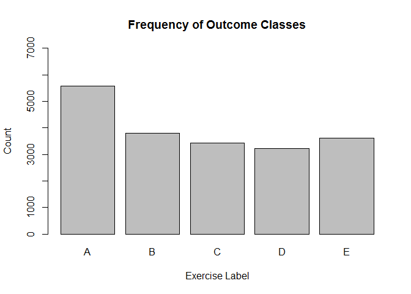
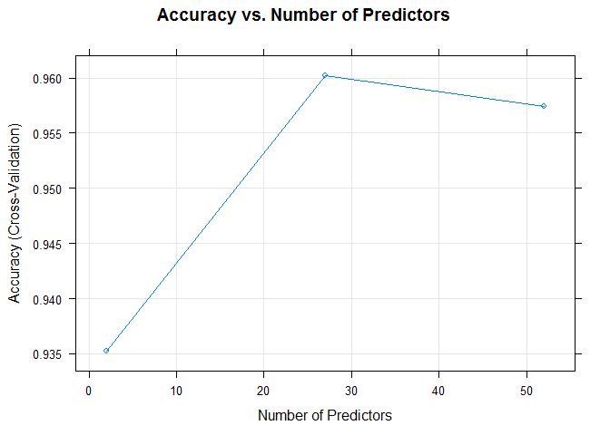
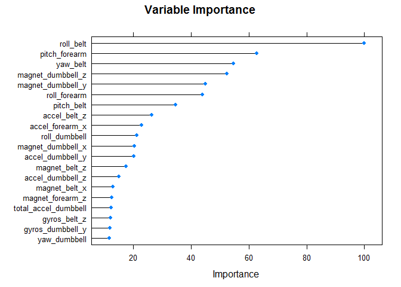
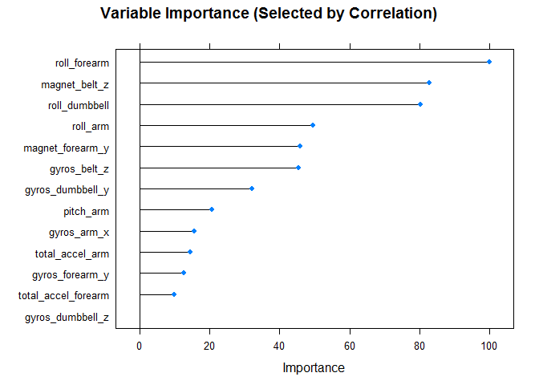

# Prediction of Exercise Execution
Teresa Wilson  
May 15, 2016  


## Synopsis

A random forest model was created to predict how well 6 subjects performed a weightlifting exercise based on data collected by on-body sensors. The model was able to predict the type of exercise "mistake" with an accuracy of 0.96. The model was then used to predict a set of 20 test cases.

## Introduction

The quantified-self movement generates a large amount of data from devices such as *Jawbone Up, Nike FuelBand,* and *Fitbit*. Human activiy recognition has focused on quantifying how *much* of an activity people do, but it has rarely been used to quantify how *well* they do the activity.

Six participants performed repetitions of the Unilateral Dumbbell Biceps Curl in five different ways: exactly according to the specification (Class A), throwing the elbows to the front (Class B), lifting the dumbbell only halfway (Class C), lowering the dumbbell only halfway (Class D), and throwing the hips to the front (Class E). Class A was the "correct" way to perform the exercise, and Classes B-E were "mistakes".

Motion was measured by sensors placed on the glove, armband, belt, and dumbbell. The sensors consisted of an accelerometer, a gyroscope, and a magentometer, generating a total of 153 different variables for each observation.

More information on the data can be found at http://groupware.les.inf.puc-rio.br/har and in reference [1] at the end of this report.

This study attempts to predict the manner in which the participant performed the exercise.

## Read Data

First, we'll read in the data. Two `csv` files are provided, a training file and a testing file. 


```r
training <- read.csv("pml-training.csv", sep = ",", header = TRUE)
testCaseData <- read.csv("pml-testing.csv", sep = ",", header = TRUE)
```

The data from the `pml-testing.csv` file is actually a set of 20 test cases to be evaluated with the final model, and the data variable is named accordingly.

## Exploratory Analysis


The dimensions of the training set are 


```r
dim(training)
```

```
[1] 19622   160
```

Because the dimensions are so large, we'll only display the first few rows and a few columns at a time. 

The first 7 columns are data about the subject and measurement conditions. These columns will not be included as input variables to the model because they are not data generated by the sensors.


```r
training[1:5, 1:7]
```

```
  X user_name raw_timestamp_part_1 raw_timestamp_part_2   cvtd_timestamp
1 1  carlitos           1323084231               788290 05/12/2011 11:23
2 2  carlitos           1323084231               808298 05/12/2011 11:23
3 3  carlitos           1323084231               820366 05/12/2011 11:23
4 4  carlitos           1323084232               120339 05/12/2011 11:23
5 5  carlitos           1323084232               196328 05/12/2011 11:23
  new_window num_window
1         no         11
2         no         11
3         no         11
4         no         12
5         no         12
```

Now we'll look at the last few columns:


```r
training[1:5, (ncol(training)-5):ncol(training)]
```

```
  accel_forearm_y accel_forearm_z magnet_forearm_x magnet_forearm_y
1             203            -215              -17              654
2             203            -216              -18              661
3             204            -213              -18              658
4             206            -214              -16              658
5             206            -214              -17              655
  magnet_forearm_z classe
1              476      A
2              473      A
3              469      A
4              469      A
5              473      A
```

The last column is the variable `classe`, which will be the response variable we'll train the model on.

As shown in the bar plot, the outcome variable is approximately evenly distributed across all values, but with a larger number of the class `A`.


```r
barplot(table(training$classe), main = "Frequency of Outcome Classes",
        ylim = c(0, 7000), xlab = "Exercise Label",
        ylab = "Count")
```

<!-- -->


The input data for the test cases have only 20 observations but the same number of variables:


```r
dim(testCaseData)
```

```
[1]  20 160
```

We can look at all the rows and the last few columns to get an idea of the data:


```r
testCaseData[ , (ncol(testCaseData)-4):ncol(testCaseData)]
```

```
   accel_forearm_z magnet_forearm_x magnet_forearm_y magnet_forearm_z
1             -149             -714              419              617
2             -118             -237              791              873
3             -129              -51              698              783
4              -39             -233              783              521
5              172              375             -787               91
6             -144             -300              800              884
7             -175             -678              284              585
8             -282             -109             -619              -32
9             -217                0              652              469
10              -7             -403              723              512
11            -203             -248              720              438
12            -148               32              648              702
13             167              456             -677               29
14            -198              123              555              648
15            -226             -540             -155              389
16             171              532             -775              114
17            -154             -146              756              708
18            -202             -500             -232              329
19            -172             -614              -46              471
20             179               70             -703               74
   problem_id
1           1
2           2
3           3
4           4
5           5
6           6
7           7
8           8
9           9
10         10
11         11
12         12
13         13
14         14
15         15
16         16
17         17
18         18
19         19
20         20
```

For the test case data, the last column is the problem ID (or test case ID) rather than the response `classe`.

## Data Preprocessing

The data were preprocessed to create a training set that could be input to the model. The steps included creating a subset of observations for the training set, removing variables that could not be used as features, and removing missing values.

### Create training data set

Due to memory limitations of the computer used for the calculations, the size of the training set was constrained. The computer could train the model on a data set up to a maximum size of 25% of the original data set before running into memory problems. So a training set equal to 25% of the original data set was created using the `createDataPartition` function from the `caret` package, which randomly samples the data set while maintaining the original frequencies of the response values (the variable `classe`). 

Note: The random forest algorithm used in the model calculates out-of-bag error in the course of the calculations, and this can be used as an estimate for the out-of-sample error. That would mean there is no need for a testing data set, but we'll set aside the remaining 75% of the data anyway as a testing set to use as an additional check. 

The seed is set beforehand to create reproducible results. 


```r
set.seed(1000)
inTrain = createDataPartition(training$classe, p = .25)[[1]]
trainingSplit = training[ inTrain,]
testingSplit = training[-inTrain,]
```

This gives a training set with 4907 observations and 160 variables.

### Remove unnecessary columns 

The first 7 columns are removed from the data sets. These are information about the subject and the measurement conditions and cannot be used as features in the model.


```r
trainData <- trainingSplit[ , 8:ncol(trainingSplit)]
testData <- testingSplit[ , 8:ncol(testingSplit)]  
testCaseData <- testCaseData[ , 8:ncol(testCaseData)]
```

### Remove missing values

Several of the variables contain no data (i.e., they have value `NA` for all observations). These variables need to be removed from the data set because you can't model data that isn't there. We'll determine the variables in the training set that are all `NA`s.


```r
indexNA_train <- colSums(is.na(trainData)) != 0
sum(indexNA_train)  
```

```
[1] 67
```

In the training data set, 67 of the variables are all `NA`s.

We do the same for the test case data set.


```r
indexNA_testCase <- colSums(is.na(testCaseData)) != 0
sum(indexNA_testCase)  
```

```
[1] 100
```

In the test case data set, 100 of the variables are all `NA`s. Since there are a total of 153 variables, this means that there are 53 variables that are not all `NA`s. This is the maximum subset that we should train the model on because a model cannot be used for prediction if a variable is missing, and if the entire column is missing, imputation is not possible.

We subset the training data to remove variables found in the test case data set that are all `NA`s.


```r
trainData <- subset(trainData, select = !indexNA_testCase)
dim(trainData) 
```

```
[1] 4907   53
```

We check to make sure there are no missing values in the training data set.


```r
sum(is.na(trainData))
```

```
[1] 0
```

This is now the data set that we'll use to train the model. It contains 53 columns: 52 features and one column (`classe`) that is the response variable.

## Description of Model

The random forest algorithm was chosen for the model because this is a classification problem and we expect the data to have a weak signal and a high level of noise noise due to the exercise movements that were performed.

### Cross-validation

Ten-fold cross-validation was used in the random forest model to determine the variable importance and the variables used at each tree node.

### Out-of-sample error estimate

The random forest method (`rf`) in the `caret` package automatically calculates an "out-of-bag" (OOB) error estimate when fitting trees to resampled subsets of the data, so this value can be used as an estimate for the out-of-sample error.

## Train model

The model was trained on the training data set using all 52 features. The maximum number of trees was set at 10 due to memory limitations of the computer.
 

```r
set.seed(2000)
modFit <- train(classe ~ ., 
                method = "rf", 
                data = trainData, 
                prox = TRUE, 
                ntree = 10,
                trControl = trainControl(method = "cv"))
```

## Results

### Out-of-sample error estimate

The out-of-bag error estimate was 7.63%, which is also an estimate for the out-of-sample error. The confusion matrix is shown with the error estimates for each class.


```r
modFit$finalModel
```

```

Call:
 randomForest(x = x, y = y, ntree = 10, mtry = param$mtry, proximity = TRUE) 
               Type of random forest: classification
                     Number of trees: 10
No. of variables tried at each split: 27

        OOB estimate of  error rate: 7.63%
Confusion matrix:
     A   B   C   D   E class.error
A 1339  20   7  10   7  0.03181490
B   58 839  23   7  17  0.11122881
C    8  48 772  16   6  0.09176471
D   14  21  33 720   3  0.08975980
E    8  22  21  22 821  0.08165548
```

### Accuracy 

The accuracy for the final model was 0.96.


```r
modFit
```

```
Random Forest 

4907 samples
  52 predictor
   5 classes: 'A', 'B', 'C', 'D', 'E' 

No pre-processing
Resampling: Cross-Validated (10 fold) 
Summary of sample sizes: 4417, 4416, 4417, 4417, 4414, 4417, ... 
Resampling results across tuning parameters:

  mtry  Accuracy   Kappa    
   2    0.9351945  0.9179014
  27    0.9602568  0.9497061
  52    0.9574108  0.9460878

Accuracy was used to select the optimal model using  the largest value.
The final value used for the model was mtry = 27. 
```

This plot shows the accuracy of the cross-validation as a function of the number of randomly selected predictors. The model reaches maximum accuracy using about half of the predictors.


```r
plot(modFit, main = "Accuracy vs. Number of Predictors",
     xlab = "Number of Predictors")  
```

<!-- -->

### Variable Importance

The variable importance determines the most important variables in the model,  where the importance is scaled from 0 to 100.


```r
varImp(modFit)
```

```
rf variable importance

  only 20 most important variables shown (out of 52)

                     Overall
roll_belt             100.00
pitch_forearm          62.82
yaw_belt               54.61
magnet_dumbbell_z      52.32
magnet_dumbbell_y      44.90
roll_forearm           43.95
pitch_belt             34.63
accel_belt_z           26.27
accel_forearm_x        22.81
roll_dumbbell          21.16
magnet_dumbbell_x      20.27
accel_dumbbell_y       20.18
magnet_belt_z          17.39
accel_dumbbell_z       14.91
magnet_belt_x          13.03
magnet_forearm_z       12.48
total_accel_dumbbell   12.22
gyros_belt_z           12.09
gyros_dumbbell_y       11.92
yaw_dumbbell           11.60
```

The next plot shows the same information graphically. The top 7 variables have the largest relative importance, and the remaining variables have much lower importance.


```r
plot(varImp(modFit), top=20, main = "Variable Importance")
```

<!-- -->

### Feature selection 

The random forests method determines the important features as it calculates the model on all the features available. Another way to determine the important features is to do feature selection before running the model by removing the features that are highly correlated. The model is then run with this subset of features, which reduces computation time. We will try this method of feature selection to see if it gives better accuracy.

First, the correlation matrix of all features is calculated.


```r
set.seed(2)
correlationMatrix <- cor(trainData[ , 1:(ncol(trainData)-1)])
```

If the correlation is greater than 0.25, then those features are removed from the data set because they are highly correlated. 


```r
highlyCorrelated <- findCorrelation(correlationMatrix, cutoff=0.25)
trainDataSub <- trainData[ , -highlyCorrelated]
```

The resulting data set contains only the following features.


```r
names(trainDataSub)
```

```
 [1] "gyros_belt_z"        "magnet_belt_z"       "roll_arm"           
 [4] "pitch_arm"           "total_accel_arm"     "gyros_arm_x"        
 [7] "roll_dumbbell"       "gyros_dumbbell_y"    "gyros_dumbbell_z"   
[10] "roll_forearm"        "total_accel_forearm" "gyros_forearm_y"    
[13] "magnet_forearm_y"    "classe"             
```

This creates a data set with 13 features that are used to train the model with the same parameters as for the model with the full feature set. The results of this model are below.


```
Random Forest 

4907 samples
  13 predictor
   5 classes: 'A', 'B', 'C', 'D', 'E' 

No pre-processing
Resampling: Cross-Validated (10 fold) 
Summary of sample sizes: 4417, 4416, 4417, 4417, 4414, 4417, ... 
Resampling results across tuning parameters:

  mtry  Accuracy   Kappa    
   2    0.8917791  0.8628320
   7    0.8952323  0.8673417
  13    0.8944334  0.8663157

Accuracy was used to select the optimal model using  the largest value.
The final value used for the model was mtry = 7. 
```

With the reduced number of features, the accuracy is only 0.90, which is less than the accuracy of 0.96 obtained with the full feature set. 

We can plot the variable importance again and see that the model ranked the variables in a different order this time. Selecting variables via the correlation matrix can omit influential variables, which affects the accuracy and the importance of individual variables.


```r
plot(varImp(modFitSub), top = (dim(trainDataSub)[2] - 1),
     main = "Variable Importance (Selected by Correlation)")
```

<!-- -->


## Prediction Using the Model

We will use the model with all 52 features for prediction on a test set of the original data and on a set of 20 test cases.

### Prediction on test set 

The random forest algorithm calculates the out-of-sample error (really the out-of-bag error) automatically during the course of the optimization, but it is interesting to calculate it on a separate test set anyway to compare the accuracy.

The test data set, with 14715 observations, was used to predict the class values.


```r
dim(testData)[1] 
```

```
[1] 14715
```

The model using the full number of features was used to predict on the test data.


```r
predTest <- predict(modFit, newdata = testData)
confusionMatrix(data = predTest, testData$classe)
```

```
Confusion Matrix and Statistics

          Reference
Prediction    A    B    C    D    E
         A 4143  100    0   12    5
         B   30 2686  128   21   34
         C    8   49 2408  120   16
         D    4    5   27 2249   31
         E    0    7    3   10 2619

Overall Statistics
                                          
               Accuracy : 0.9585          
                 95% CI : (0.9552, 0.9617)
    No Information Rate : 0.2844          
    P-Value [Acc > NIR] : < 2.2e-16       
                                          
                  Kappa : 0.9475          
 Mcnemar's Test P-Value : < 2.2e-16       

Statistics by Class:

                     Class: A Class: B Class: C Class: D Class: E
Sensitivity            0.9900   0.9434   0.9384   0.9324   0.9682
Specificity            0.9889   0.9821   0.9841   0.9946   0.9983
Pos Pred Value         0.9725   0.9265   0.9258   0.9711   0.9924
Neg Pred Value         0.9960   0.9864   0.9870   0.9869   0.9929
Prevalence             0.2844   0.1935   0.1744   0.1639   0.1838
Detection Rate         0.2815   0.1825   0.1636   0.1528   0.1780
Detection Prevalence   0.2895   0.1970   0.1768   0.1574   0.1793
Balanced Accuracy      0.9894   0.9628   0.9613   0.9635   0.9833
```

The accuracy was 0.9585, which is close to the OOB error of 0.96 calculated from the model. Therefore, the OOB error calculated on the training set was a good estimate of the out-of-sample error.

### Prediction on test cases 

Next, the model using the full number of features was used to predict on the 20 test cases.


```r
predTestCase <- predict(modFit, newdata = testCaseData)
truthClass <- c("B", "A", "B", "A", "A", "E", "D", "B", "A", "A", "B", 
                "C", "B", "A", "E", "E", "A", "B", "B", "B")
knitr::kable(data.frame(testCase = as.factor(testCaseData$problem_id), 
                        predClass = predTestCase, truthClass))
```


testCase   predClass   truthClass 
---------  ----------  -----------
1          B           B          
2          A           A          
3          B           B          
4          A           A          
5          A           A          
6          E           E          
7          D           D          
8          B           B          
9          A           A          
10         A           A          
11         B           B          
12         C           C          
13         B           B          
14         A           A          
15         E           E          
16         E           E          
17         A           A          
18         B           B          
19         B           B          
20         B           B          

The model was able to correctly predict all 20 test cases.

## Conclusion

A random forest model was able to predict with 0.96 accuracy how well a participant performed an exercise. Using a computer with more memory may increase the accuracy because a larger training set and a larger number of trees could be used. 

## References

[1] Velloso, E.; Bulling, A.; Gellersen, H.; Ugulino, W.; Fuks, H. Qualitative Activity Recognition of Weight Lifting Exercises. Proceedings of 4th International Conference in Cooperation with SIGCHI (Augmented Human '13). Stuttgart, Germany: ACM SIGCHI, 2013.


